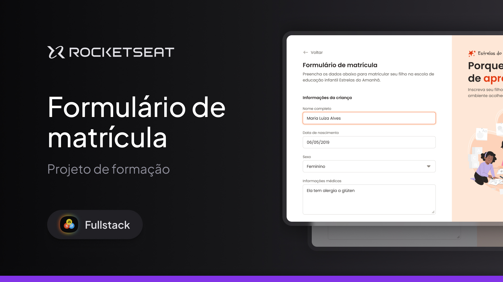

<h1 align="center">Formulário de Matrícula</h1>

Um formulário desktop para uma escola de educação infantil. 🎒📚
 
Esse é um dos projetos desenvolvidos em aula na formação Full-stack, dentro dos conteúdos de especialização. 

  <a href="#-tecnologias">Tecnologias</a>&nbsp;&nbsp;&nbsp;|&nbsp;&nbsp;&nbsp;
  <a href="#-projeto">Projeto</a>&nbsp;&nbsp;&nbsp;|&nbsp;&nbsp;&nbsp;
  <a href="#-layout">Layout</a>&nbsp;&nbsp;&nbsp;|&nbsp;&nbsp;&nbsp;
  <a href="#memo-licença">Licença</a>

  

 

  

## 🚀 Tecnologias

Esse projeto foi desenvolvido com as seguintes tecnologias:

- HTML e CSS
- Git e Github
- Figma

## 💻 Projeto

Um formulário desktop para uma escola de educação infantil, a "Estrelas do Amanhã". Nesse projeto, continuamos explorando o CSS Grid, mas, na grande maioria do projeto os inputs foram os protagonistas, conteúdo que faz parte do módulo atual da Rocketseat. No desenvolvimento desse projeto, construí uma base sólida sobre esse conteúdo tão importante no mundo do desenvolvimento, o próximo projeto será um desafio prático! Estou pronto para os próximos projetos. 👨‍💻

## 🔖 Layout

Você pode visualizar o layout do projeto através [DESSE LINK](https://www.figma.com/design/6lqrwjiuYDzrs0Y7wATTgq/Formul%C3%A1rio-de-matr%C3%ADcula--Community---Copy-?m=auto&t=pB0lefX7DjxG3R0f-6). É necessário ter conta no [Figma](https://figma.com) para acessá-lo.

## :memo: Licença

Esse projeto está sob a licença MIT.

---

Feito com ♥ by Arthur Costa :wave: